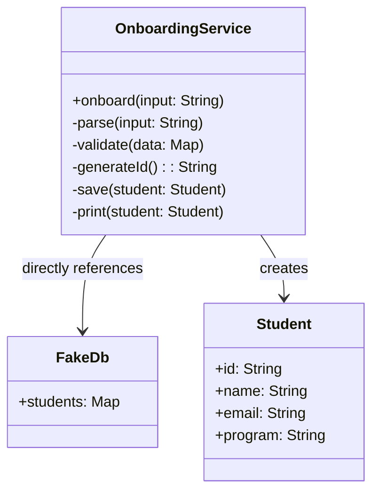
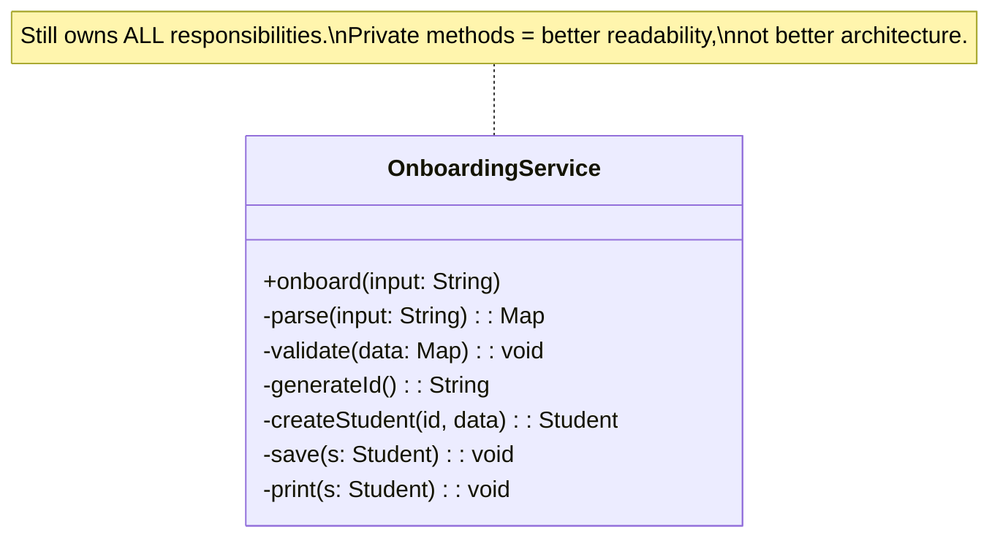
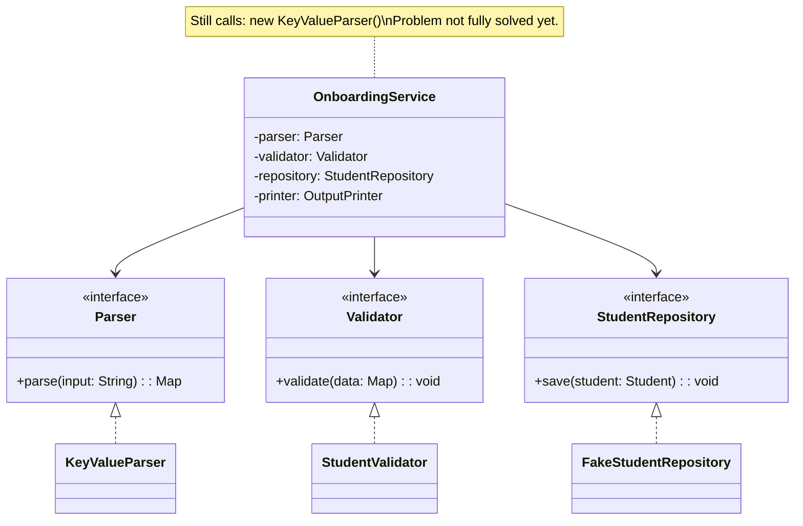
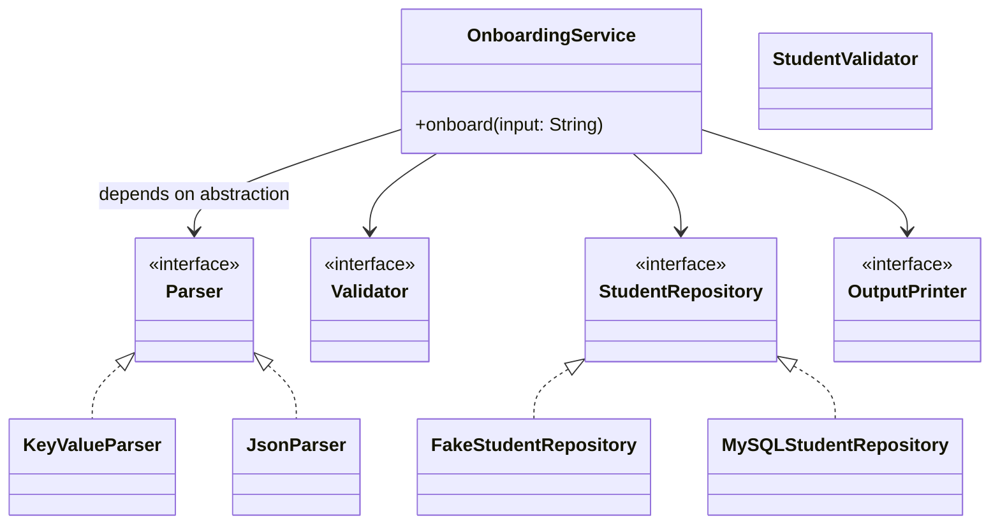
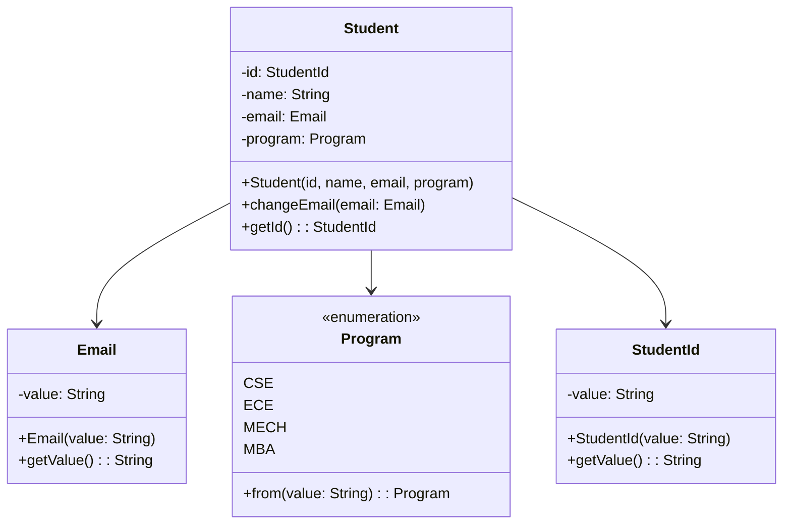
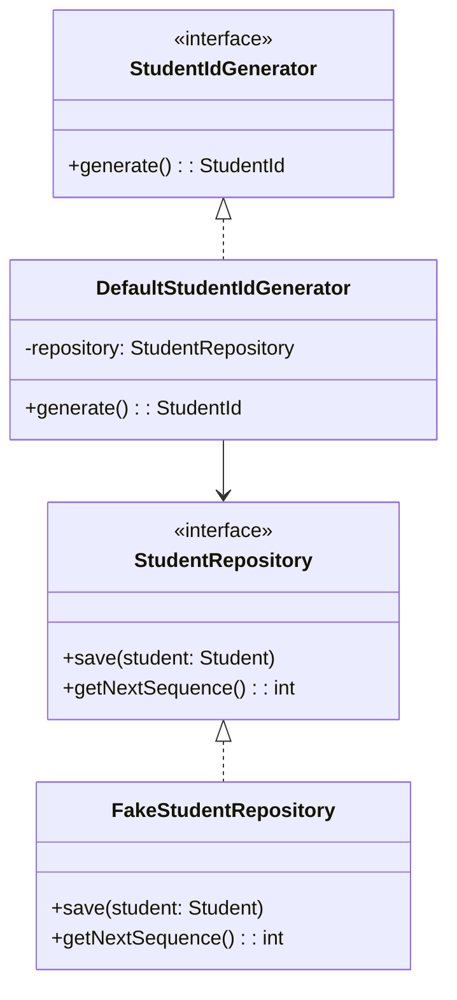
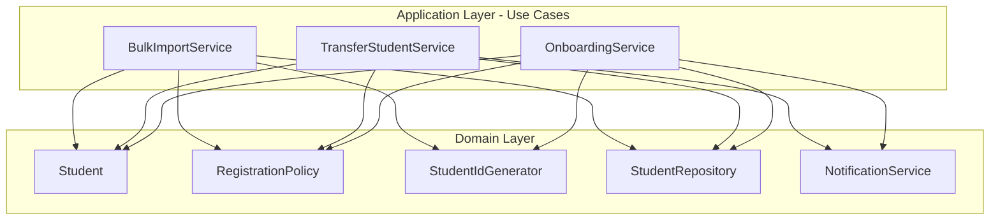
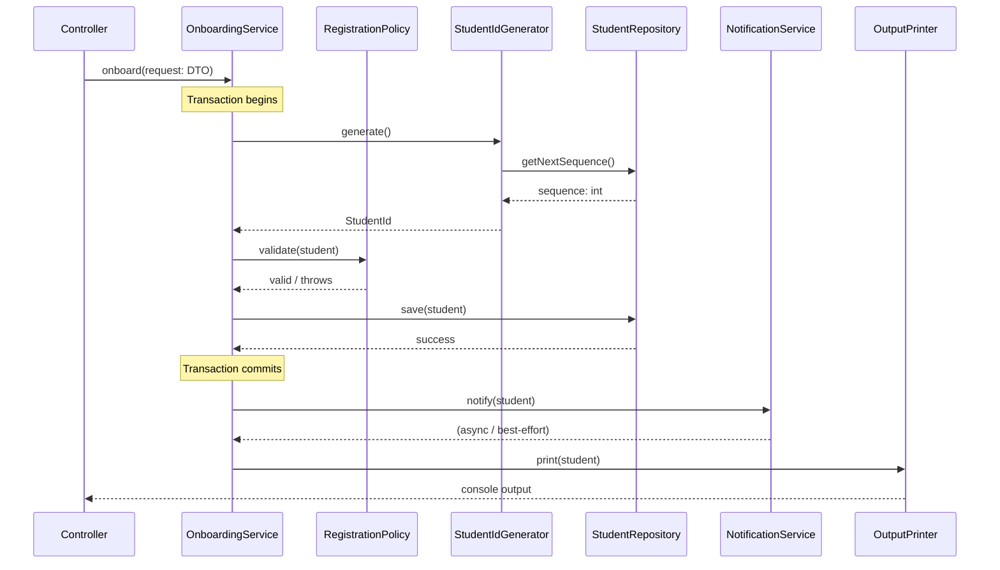
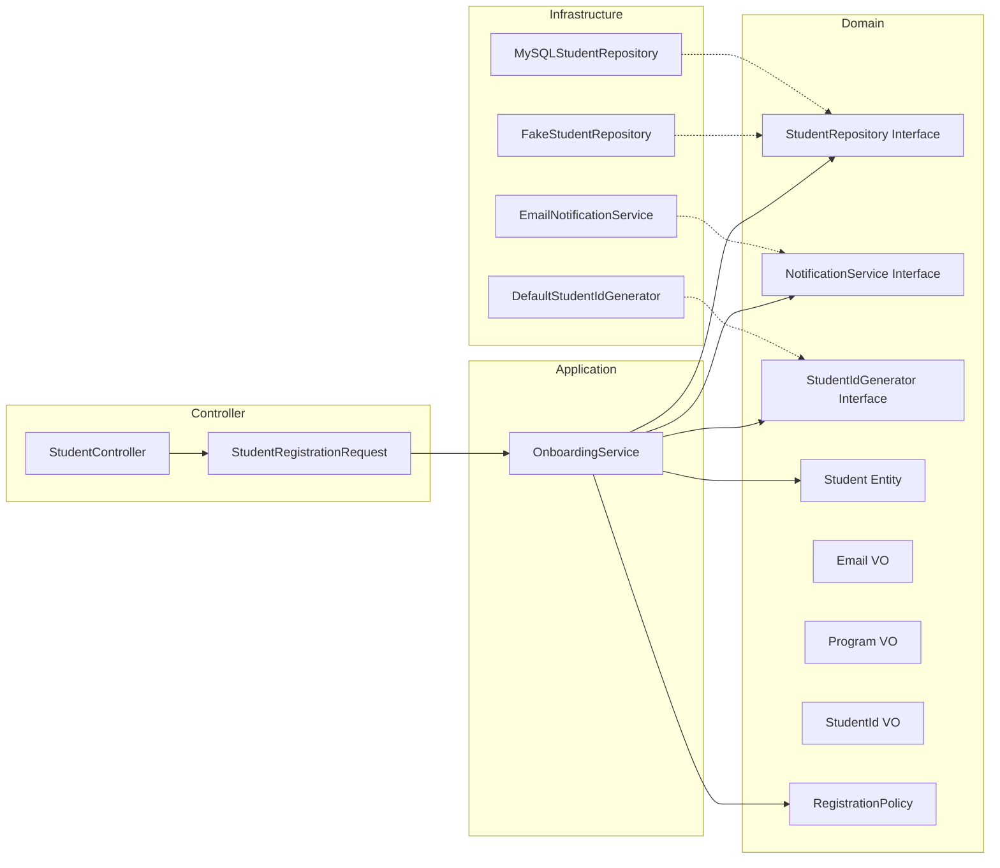

# LLD Case Study: Student Onboarding Registration
## An Architectural Evolution Journey

---

## Table of Contents

1. [Problem Statement](#1-problem-statement)
2. [Version 0 — Naive Design](#2-version-0--naive-design)
3. [First Refactor — Method Extraction](#3-first-refactor--method-extraction)
4. [Introduction of Abstractions](#4-introduction-of-abstractions)
5. [Dependency Inversion Applied](#5-dependency-inversion-applied)
6. [Separation of Layers](#6-separation-of-layers)
7. [Rich Domain Modeling](#7-rich-domain-modeling)
8. [Domain Services](#8-domain-services)
9. [Use Case vs Domain Separation](#9-use-case-vs-domain-separation)
10. [Transaction Boundaries](#10-transaction-boundaries)
11. [Final Clean Architecture](#11-final-clean-architecture)
12. [Reflection — Lessons Learned](#12-reflection--lessons-learned)

---

## 1. Problem Statement

### The Original Problem

Design a **Student Onboarding Registration System** that:

- Accepts raw string input in the format:
  ```
  name=Riya;email=riya@sst.edu;phone=9876543210;program=CSE
  ```
- Validates all fields (non-empty, valid email format, valid phone, allowed program)
- Generates a structured student ID of the format: `SST-2026-0001`
- Persists the student record to an in-memory database
- Prints a confirmation message and a data dump to console

### Initial Constraints

- Output must remain **exactly unchanged** — any refactoring must preserve user-visible behavior
- System must be extensible for future requirements (new programs, different input formats, notifications)
- Code must be testable and maintainable

### Technical Environment Assumptions

- Language: Java
- No real database; `FakeDb` used as in-memory persistence
- Single-threaded execution
- Console-based I/O for now

---

## 2. Version 0 — Naive Design

### What It Looked Like

Everything — parsing, validation, ID generation, persistence, and printing — lived inside a single method in a single class.

```java
class OnboardingService {

    void onboard(String input) {
        // Step 1: Parse
        Map<String, String> data = new HashMap<>();
        for (String part : input.split(";")) {
            String[] kv = part.split("=");
            data.put(kv[0], kv[1]);
        }

        // Step 2: Validate
        if (data.get("name") == null || data.get("name").isBlank()) {
            System.out.println("Error: name is required");
            return;
        }
        if (!data.get("email").contains("@")) {
            System.out.println("Error: invalid email");
            return;
        }
        // ... more validation ...

        // Step 3: Generate ID
        int seq = FakeDb.students.size() + 1;
        String id = "SST-" + Year.now().getValue() + "-" + String.format("%04d", seq);

        // Step 4: Save
        Student s = new Student(id, data.get("name"), data.get("email"), data.get("program"));
        FakeDb.students.put(id, s);

        // Step 5: Print
        System.out.println("Student registered: " + id);
        FakeDb.students.forEach((k, v) -> System.out.println(k + " → " + v));
    }
}
```

### Responsibility Breakdown

| Step | Responsibility |
|------|---------------|
| Parsing | Raw string → key-value map |
| Validation | Format and business rule checks |
| ID Generation | Sequence + year + prefix logic |
| Persistence | FakeDb insertion |
| Printing | Console output + table dump |

All five responsibilities are owned by **one method** in **one class**.

### Design Smells

- **Long Method**: The `onboard()` method does too many things
- **Deep Nesting**: Validation conditionals are interleaved with business logic
- **Hardcoded Dependencies**: `FakeDb` is referenced directly with no abstraction
- **Mixed Levels of Abstraction**: Low-level string parsing sits next to high-level workflow coordination
- **Inline Error Handling**: Error messages printed directly in the middle of logic

### SOLID Violations

- **SRP (Single Responsibility)**: The class has at least five independent reasons to change
- **OCP (Open/Closed)**: Adding a new program or new notification requires modifying existing code
- **DIP (Dependency Inversion)**: High-level workflow depends directly on `FakeDb` (low-level detail)

### Testability Issues

- Cannot test validation in isolation — must execute full onboard flow
- Cannot mock persistence — FakeDb is directly referenced
- Cannot test parsing independently
- Any test must exercise all concerns simultaneously

### Mermaid Diagram — V0 Naive Design



---

## 3. First Refactor — Method Extraction

### The Approach

Split the monolithic `onboard()` into private helper methods within `OnboardingService`:

```java
class OnboardingService {

    void onboard(String input) {
        Map<String, String> data = parse(input);
        validate(data);
        String id = generateId();
        Student s = createStudent(id, data);
        save(s);
        print(s);
    }

    private Map<String, String> parse(String input) { ... }
    private void validate(Map<String, String> data) { ... }
    private String generateId() { ... }
    private Student createStudent(String id, Map<String, String> data) { ... }
    private void save(Student s) { ... }
    private void print(Student s) { ... }
}
```

### Pros

- Significantly more **readable** — each method name signals intent
- Easier to navigate in an IDE
- Each step is visually separated
- `onboard()` now reads like a story

### Limitations

- **SRP still violated** — one class, five reasons to change
- **Change axes still coupled** — modifying `FakeDb` still requires opening `OnboardingService`
- **Testability unchanged** — private methods cannot be independently unit tested
- **Reusability still zero** — parsing logic cannot be shared with another service
- No improvement in **extensibility** — adding email notification requires modifying this class

### Key Insight

Method extraction improves **readability** but not **architecture**. The class still owns all responsibilities — they are simply better organized, not properly separated.

### Mermaid Diagram — V1 Method Extraction



---

## 4. Introduction of Abstractions

### The Insight

`OnboardingService` should not know *how* parsing is implemented. It should only know *that* parsing must happen.

This distinction — knowing *that* vs knowing *how* — is the foundation of abstraction.

### Interface Extraction

```java
interface Parser {
    Map<String, String> parse(String input);
}

interface Validator {
    void validate(Map<String, String> data);
}

interface StudentRepository {
    void save(Student student);
}

interface OutputPrinter {
    void print(Student student);
}
```

### Concrete Implementations

```java
class KeyValueParser implements Parser {
    public Map<String, String> parse(String input) { ... }
}

class StudentValidator implements Validator {
    public void validate(Map<String, String> data) { ... }
}

class FakeStudentRepository implements StudentRepository {
    public void save(Student student) { ... }
}
```

### Runtime Polymorphism

Now `OnboardingService` can depend on the `Parser` interface — it does not know which parser implementation will run.

### Why Abstraction Alone Was Not Enough

Even with interfaces, if we write:

```java
class OnboardingService {
    Parser parser = new KeyValueParser();  // ← Still tightly coupled!
}
```

...we still create the concrete class inside the orchestrator.

`OnboardingService` still knows about `KeyValueParser`. If the format changes to JSON:

```java
Parser parser = new JsonParser();  // ← Must modify OnboardingService
```

That is a violation of both SRP and OCP.

**Abstraction without injection is incomplete.**

### Mermaid Diagram — V2 Abstractions



---

## 5. Dependency Inversion Applied

### The Principle

> High-level modules should not depend on low-level modules. Both should depend on abstractions.

This is the **Dependency Inversion Principle (DIP)**.

Notice the word *inversion*:

- **Before DIP**: High-level → depends on → Low-level concrete class
- **After DIP**: High-level → depends on → Abstraction ← Low-level implements

### Constructor Injection

Instead of creating dependencies internally, they are **provided from outside**:

```java
class OnboardingService {

    private final Parser parser;
    private final Validator validator;
    private final StudentRepository repository;
    private final OutputPrinter printer;
    private final StudentIdGenerator idGenerator;

    public OnboardingService(
        Parser parser,
        Validator validator,
        StudentRepository repository,
        OutputPrinter printer,
        StudentIdGenerator idGenerator
    ) {
        this.parser = parser;
        this.validator = validator;
        this.repository = repository;
        this.printer = printer;
        this.idGenerator = idGenerator;
    }

    public void onboard(String input) {
        Map<String, String> data = parser.parse(input);
        validator.validate(data);
        StudentId id = idGenerator.generate();
        Student student = new Student(id, data);
        repository.save(student);
        printer.print(student);
    }
}
```

Now some **outer layer** decides which implementations to wire:

```java
// Wiring (done outside the use case)
Parser parser = new KeyValueParser();
Validator validator = new StudentValidator();
StudentRepository repository = new FakeStudentRepository();
OutputPrinter printer = new ConsolePrinter();

OnboardingService service = new OnboardingService(
    parser, validator, repository, printer, idGenerator
);
```

### Testability Improvement

Now we can inject mocks in tests:

```java
Parser mockParser = (input) -> Map.of("name","Riya","email","riya@sst.edu",...);
StudentRepository mockRepo = Mockito.mock(StudentRepository.class);

OnboardingService testableService = new OnboardingService(
    mockParser, noopValidator, mockRepo, noopPrinter, mockIdGen
);
```

Each collaborator can be replaced independently.

### Mermaid Diagram — V3 Dependency Inversion



---

## 6. Separation of Layers

### The Problem With a Flat Design

Even with DIP applied, all our classes exist in one conceptual layer. There is no clear boundary that says:

- *This handles HTTP/input concerns*
- *This handles business workflow*
- *This enforces business rules*
- *This accesses infrastructure*

Without layers, changes in one concern still risk bleeding into others.

### Introducing Layered Architecture

```
┌─────────────────────────────────┐
│         Controller Layer        │  ← Receives raw input, formats output
├─────────────────────────────────┤
│     Application Layer (Use Case)│  ← Orchestrates workflow (OnboardingService)
├─────────────────────────────────┤
│          Domain Layer           │  ← Student, RegistrationPolicy, StudentId
├─────────────────────────────────┤
│       Infrastructure Layer      │  ← FakeDb, MySQL, Email, SMS
└─────────────────────────────────┘
```

### What Belongs Where

**Controller Layer**
- Receives raw input (CLI string, REST request, CLI args)
- Parses raw input into a structured DTO
- Performs format validation (non-null fields, email regex, phone length)
- Calls the use case with a clean DTO
- Formats and returns the response

**DTO (Data Transfer Object)**
- Plain data holder — no logic, no validation
- Carries structured data from controller to use case
- Example: `StudentRegistrationRequest { name, email, phone, program }`

**Application Layer (Use Case)**
- `OnboardingService` — orchestrates the workflow
- Calls domain services, repositories, notifiers
- Owns the transaction boundary
- Does not implement business rules — invokes them

**Domain Layer**
- `Student` entity with invariants enforced in constructor
- Value objects: `Email`, `PhoneNumber`, `StudentId`, `Program`
- `RegistrationPolicy` — domain-level business rules
- `StudentIdGenerator` — domain service for ID composition

**Infrastructure Layer**
- `FakeStudentRepository` implements `StudentRepository`
- Database adapters, file systems, email/SMS senders
- Sequence number source (database auto-increment)

### Mermaid Diagram — Layered Architecture

```mermaid
flowchart TD
    subgraph Controller["Controller Layer"]
        C[StudentController]
        DTO[StudentRegistrationRequest DTO]
    end

    subgraph Application["Application Layer (Use Case)"]
        OS[OnboardingService]
    end

    subgraph Domain["Domain Layer"]
        S[Student Entity]
        E[Email Value Object]
        P[Program Value Object]
        SID[StudentId Value Object]
        RP[RegistrationPolicy]
        SIG[StudentIdGenerator - Domain Service]
        SR[StudentRepository - Interface]
        NS[NotificationService - Interface]
    end

    subgraph Infrastructure["Infrastructure Layer"]
        FSR[FakeStudentRepository]
        MSR[MySQLStudentRepository]
        ES[EmailNotificationService]
        SMS[SmsNotificationService]
    end

    C --> DTO
    DTO --> OS
    OS --> S
    OS --> RP
    OS --> SIG
    OS --> SR
    OS --> NS
    SR <|.. FSR
    SR <|.. MSR
    NS <|.. ES
    NS <|.. SMS
```

---

## 7. Rich Domain Modeling

### The Anemic Domain Model Trap

An **anemic domain model** has entities that are just data containers — getters, setters, no logic:

```java
// Anemic - dangerous
class Student {
    private String email;
    public void setEmail(String email) { this.email = email; }  // no validation!
}
```

This means:
- Invalid state can be set at any time
- Business rules scatter into services
- Domain knowledge is lost

### Rich Domain Model

A **rich domain model** means entities enforce their own invariants and cannot be created or mutated into an invalid state.

### Value Objects

Value objects are **immutable**, **self-validating**, and have **no identity** — they are equal by value.

```java
// Email Value Object
public final class Email {
    private final String value;

    public Email(String value) {
        if (value == null || !value.matches("^[\\w.]+@[\\w.]+\\.[a-z]{2,}$")) {
            throw new InvalidEmailException("Email format is invalid: " + value);
        }
        this.value = value;
    }

    public String getValue() { return value; }

    @Override
    public boolean equals(Object o) { ... }
    @Override
    public int hashCode() { ... }
}
```

```java
// Program Value Object
public enum Program {
    CSE, ECE, MECH, MBA;

    public static Program from(String value) {
        try {
            return Program.valueOf(value.toUpperCase());
        } catch (IllegalArgumentException e) {
            throw new InvalidProgramException("Program not supported: " + value);
        }
    }
}
```

### Controlled Mutability in Entities

`Student` is an entity — it has identity (`StudentId`) and can change state over its lifecycle. But mutation must be **controlled**:

```java
public class Student {
    private final StudentId id;
    private final String name;
    private Email email;          // mutable — can update
    private Program program;      // mutable — transfer possible

    // Constructor enforces invariants
    public Student(StudentId id, String name, Email email, Program program) {
        if (name == null || name.isBlank()) {
            throw new InvalidStudentException("Name cannot be blank");
        }
        this.id = id;
        this.name = name;
        this.email = email;
        this.program = program;
    }

    // Controlled mutation — validation enforced
    public void changeEmail(Email newEmail) {
        this.email = newEmail;  // Email already validated on construction
    }

    // StudentId and name are immutable — never expose setters
}
```

### Layered Defense

- **Controller**: First line — rejects malformed requests early, provides user-friendly errors
- **Domain / Value Objects**: Second line — guarantees internal consistency regardless of entry point

Even if a batch job bypasses the controller, `Student` and `Email` protect themselves.

### Mermaid Diagram — Domain Model



---

## 8. Domain Services

### What Is a Domain Service?

A domain service encapsulates **business logic that doesn't naturally belong to a single entity**.

`StudentIdGenerator` is a domain service because:

- The ID format `SST-2026-0001` encodes **business rules** (prefix, year, sequence)
- It is not infrastructure — it represents a domain concept
- It is not part of `Student` — it exists before the student is fully constructed

### StudentIdGenerator

```java
// Domain Service Interface (lives in domain layer)
public interface StudentIdGenerator {
    StudentId generate();
}

// Domain Service Implementation (depends on repository for sequence)
public class DefaultStudentIdGenerator implements StudentIdGenerator {
    private final StudentRepository repository;

    public DefaultStudentIdGenerator(StudentRepository repository) {
        this.repository = repository;
    }

    @Override
    public StudentId generate() {
        int sequence = repository.getNextSequence();  // Infrastructure provides number
        int year = Year.now().getValue();
        String value = String.format("SST-%d-%04d", year, sequence);
        return new StudentId(value);
    }
}
```

### Separation of Concerns

| Concern | Ownership |
|---------|-----------|
| ID format/prefix rules | Domain Service (StudentIdGenerator) |
| ID uniqueness guarantee | Database (auto-increment) |
| Sequence retrieval | Repository abstraction |

The domain asks *"give me the next sequence"* via the `StudentRepository` interface. The infrastructure implements the actual SQL call. **Domain does not touch infrastructure directly.**

### Mermaid Diagram — Domain Service



---

## 9. Use Case vs Domain Separation

### The Core Principle

> Use cases should NOT call other use cases.
> Use cases share the **domain layer**, not each other.

### Why Use Cases Must Stay Independent

If `TransferStudentService` calls `OnboardingService`:

- It would re-execute onboarding-specific logic (ID generation, first-registration checks)
- Changes to onboarding could silently break transfer
- Workflows become tightly coupled
- Business intent becomes blurry

### Correct Pattern: Share Domain, Not Workflows

```
OnboardingService         TransferStudentService
        │                          │
        ▼                          ▼
 [Student, Program,     [Student, Program,
  RegistrationPolicy,    RegistrationPolicy,
  StudentIdGenerator,    StudentRepository,
  StudentRepository,     NotificationService]
  NotificationService]
        │                          │
        └────────┬─────────────────┘
                 ▼
           Domain Layer
  (Shared business objects and rules)
```

### Example: BulkImport as Separate Use Case

```java
// WRONG — reusing onboarding workflow
class BulkImportService {
    OnboardingService onboarding;

    void importFromCsv(File csv) {
        for (Row row : csv.rows()) {
            onboarding.onboard(row.toString());  // BAD: different intent, different behavior
        }
    }
}

// CORRECT — separate use case sharing domain
class BulkImportService {
    StudentRepository repository;
    StudentIdGenerator idGenerator;
    RegistrationPolicy policy;

    void importFromCsv(File csv) {
        List<Student> students = new ArrayList<>();
        for (Row row : csv.rows()) {
            policy.validate(row);  // domain rule reused
            StudentId id = idGenerator.generate();
            students.add(new Student(id, row.name(), new Email(row.email()), Program.from(row.program())));
        }
        repository.saveAll(students);  // bulk-optimized persistence
    }
}
```

### Mermaid Diagram — Multiple Use Cases



---

## 10. Transaction Boundaries

### Where Do Transactions Belong?

A transaction represents: **"all steps of this use case must succeed or fail atomically."**

This is **workflow-level atomicity** — it belongs in the **use case layer**.

| Layer | Handles | Transaction? |
|-------|---------|--------------|
| Controller | Input/output | ❌ No |
| Application (Use Case) | Workflow | ✅ Yes |
| Domain | Business rules | ❌ No |
| Repository | Single save | ❌ No |
| Infrastructure | DB connection | Provides mechanism |

### Why Not Repository?

A repository's `save()` method is too narrow — it protects one atomic DB call, not the entire workflow. Onboarding needs ID generation, saving, and side-effect triggering to all succeed or fail together.

### Side Effect Handling: Inside vs Outside Transaction

This is a nuanced design decision:

- **Inside transaction**: Notification sends before commit — if commit fails, notification already fired incorrectly
- **Outside transaction**: Student is saved and committed — notification may fail independently, can be retried

**Best practice**: Keep notifications **outside the transaction boundary**. Persist first, commit, then trigger side effects. Use eventual consistency or retry queues for notifications.

```java
// OnboardingService — transaction ownership
public void onboard(StudentRegistrationRequest request) {
    // Transaction starts
    try (Transaction tx = transactionManager.begin()) {
        StudentId id = idGenerator.generate();
        Student student = new Student(id, request.name(),
            new Email(request.email()), Program.from(request.program()));
        registrationPolicy.validate(student);
        repository.save(student);
        tx.commit();  // Commit BEFORE notification
    }

    // Outside transaction — can fail and be retried independently
    notificationService.notify(student);
    printer.print(student);
}
```

### Sequence Diagram — Onboarding Workflow



---

## 11. Final Clean Architecture

### Final Structure Overview

```
src/
├── controller/
│   └── StudentController.java           ← Raw input, DTO creation, format validation
│
├── application/
│   └── OnboardingService.java           ← Workflow orchestration, transaction boundary
│
├── domain/
│   ├── model/
│   │   ├── Student.java                 ← Rich entity, controlled mutability
│   │   ├── Email.java                   ← Immutable value object
│   │   ├── PhoneNumber.java             ← Immutable value object
│   │   ├── Program.java                 ← Validated enum
│   │   └── StudentId.java               ← Immutable value object
│   ├── service/
│   │   ├── StudentIdGenerator.java      ← Interface (domain service)
│   │   └── RegistrationPolicy.java      ← Business validation rules
│   └── repository/
│       └── StudentRepository.java       ← Interface (port)
│
├── dto/
│   └── StudentRegistrationRequest.java  ← Plain data holder
│
└── infrastructure/
    ├── FakeStudentRepository.java        ← In-memory implementation
    ├── MySQLStudentRepository.java       ← (future)
    ├── DefaultStudentIdGenerator.java    ← Composes ID from DB sequence
    └── EmailNotificationService.java     ← Notification implementation
```

### Final Dependency Flow

```
Controller → DTO → Application (Use Case) → Domain Interfaces
                                         ↖ Infrastructure implements Domain Interfaces
```

Infrastructure is at the **outermost ring** and points **inward** toward abstractions. Domain is at the **center** with **no outward dependencies**.

### Final Layered Diagram



### SOLID Principle Mapping

| Principle | How It's Applied |
|-----------|-----------------|
| **SRP** | Each class has exactly one axis of change: controller for input, use case for workflow, domain for rules, infra for implementation |
| **OCP** | New parsers, repositories, or notifiers extend without modifying existing classes |
| **LSP** | All repository or notification implementations are interchangeable |
| **ISP** | `StudentRepository` is not forced to implement notification methods — each interface is narrow |
| **DIP** | `OnboardingService` depends on abstractions (`Parser`, `StudentRepository`, etc.); implementations are injected |

### Testability Improvements

- `OnboardingService` can be tested by injecting mocks for all collaborators
- `Email`, `Program`, `StudentId` value objects can be unit-tested in isolation
- `RegistrationPolicy` can be tested independently with domain objects
- `FakeStudentRepository` itself is tested separately
- No test requires touching `FakeDb` directly

### Maintainability Improvements

- A database change requires only modifying the infrastructure layer
- A new input format requires only a new `Parser` implementation
- Business rules change only in domain / `RegistrationPolicy`
- Adding email notification is a single new class implementing `NotificationService`

---

## 12. Reflection — Lessons Learned

### How Thinking Evolved

This problem started with a simple question: *"Why not just split methods?"*

The journey moved through:

1. **Readability concern** → Method extraction
2. **Testability concern** → Interface abstraction
3. **Coupling concern** → Dependency inversion + constructor injection
4. **Boundary concern** → Layered architecture
5. **Correctness concern** → Rich domain modeling + value objects
6. **Extensibility concern** → Use case isolation + domain services
7. **Atomicity concern** → Transaction boundary placement

Each step revealed a deeper problem, not because the previous solution was wrong, but because each solution exposed the next level of complexity.

### Common Beginner Mistakes

**Confusing method count with responsibility count.** More methods in a class does not mean cleaner design. SRP is about *axes of change*, not method count.

**Using interfaces without injection.** Creating `new JsonParser()` inside a class that depends on `Parser` interface defeats the purpose. Abstraction only pays off when combined with injection.

**Confusing use cases with domain services.** Use cases are workflows. Domain services are business logic fragments. They live in different layers and serve different purposes.

**Calling use cases from use cases.** This creates workflow coupling. Instead, share the domain layer.

**Putting transaction management in repositories.** A `save()` call's transaction scope is too narrow. Transactions wrap workflows, not individual operations.

**Treating validation as monolithic.** Format validation (input concern) and business rule validation (domain concern) are different. Both are needed; they belong in different places.

### Architectural Mindset Shifts

**From "organizing code" to "organizing responsibilities."** Clean architecture is not about making code look tidy. It's about ensuring each unit of code has a clear owner and a single reason to change.

**From "how is this implemented?" to "who should own this?"** Before writing a method, ask: which layer is responsible for this concern? The answer shapes the entire design.

**From "testing the method" to "testing the boundary."** Well-designed architecture makes testing trivial because responsibilities are isolated. If testing is painful, it's usually an architectural signal.

**From "modify to extend" to "extend without modifying."** Open/Closed is only possible when abstractions are truly decoupled from implementations. Every time you think "I'll just add an if-else," consider whether an interface and a new implementation would be cleaner.

### Why SRP Is About Axis of Change

SRP is misunderstood when defined as "one task per class." The true definition:

> A module should have **one and only one reason to change**.

Different stakeholders cause different reasons to change:
- The API team changes input formats
- The business team changes validation rules
- The infrastructure team changes persistence
- The UI team changes output formatting

If all those stakeholders' concerns live in one class, any one of them can destabilize a change from another.

The axis of change is a stakeholder concern, not a method boundary.

### Why Orchestration Is a Valid Responsibility

Many developers feel uncomfortable that `OnboardingService` *does nothing* itself — it only calls others. This discomfort is misplaced.

**Orchestration is a legitimate, standalone responsibility.** A conductor in an orchestra doesn't play any instrument. Their job is coordination, and that coordination is critical.

`OnboardingService`'s single axis of change is: *"the onboarding workflow changes."* That is different from parsing changing, persistence changing, or notification changing. Coordination is a first-class concern.

### Importance of Abstraction Boundaries

Every abstraction boundary is a **stability shield**. The domain layer, protected by interface boundaries, can be completely rewritten in the infrastructure without touching business logic. The controller can be replaced (CLI → REST → gRPC) without touching the use case.

The value of an abstraction is not in the interface itself — it's in the boundary it creates. That boundary is what makes systems resilient to change.

---

*This document was produced as a learning artifact from an iterative LLD design discussion. The architectural decisions documented here represent a progression from a naive single-method implementation to a clean, SOLID-compliant layered architecture — capturing every insight, trade-off, and maturity shift along the way.*
